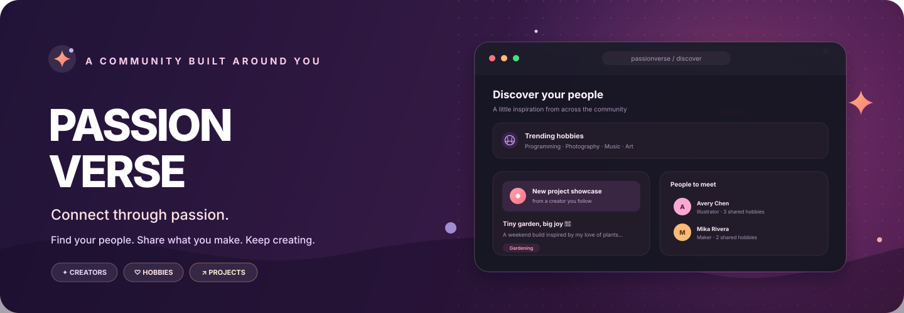
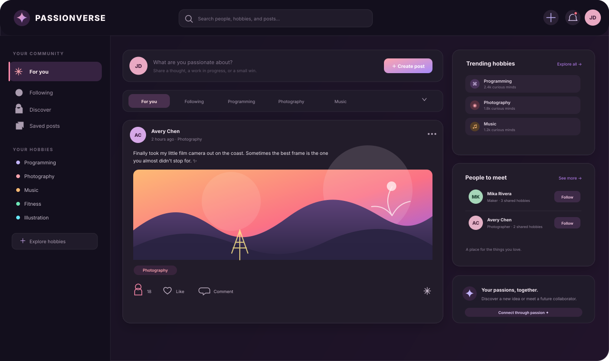

<div align="center">
  
  <h1>PassionVerse</h1>
  <p><strong>Connect through passion.</strong> Share what you make. Find your people.</p>
  <p>A hobby-focused community for discovering creators, sharing projects, and building real connections around the things you love.</p>
  <br />
  
  
  
  
  
  <br /><br />
  <a href="#features">Features</a> ·
  <a href="#getting-started">Getting started</a> ·
  <a href="#supabase-setup">Supabase setup</a> ·
  <a href="#deploy-to-vercel">Deploy</a>
</div>

---

## The idea

It can be hard to find your people when your interests span different corners of the internet. **PassionVerse brings those corners together.** Create a profile around your interests, share what you're working on, discover creators, and talk with people who get excited about the same things you do.

<div align="center">
  
  <sub>Illustrative community-feed artwork made for this README.</sub>
</div>

## Features

| | Feature | What you can do |
|:--:|---|---|
| 🔐 | **Authentication** | Sign up and sign in with email, verify your email, reset your password, or use Google OAuth. Protected routes keep signed-out users out of member pages. |
| 👤 | **Profiles** | Add an avatar, cover image, bio, location, website, and hobby tags. See follower, following, and post counts. |
| 🎨 | **Hobbies** | Explore 20+ interest categories, from Programming and AI to Photography, Music, Fitness, and Art. |
| 📰 | **Feeds** | Browse the global feed, posts from people you follow, or posts related to a selected hobby. |
| 📝 | **Posts** | Share text, images, or a project showcase with GitHub and demo links. |
| ❤️ | **Interactions** | Like, comment, reply, share, save, and report posts. |
| 👥 | **Following** | Follow and unfollow creators, then view your followers and following lists. |
| 🔎 | **Search** | Search people by name or username, browse hobbies, and find post content. |
| 🧭 | **Discover** | Find suggested users, trending hobbies, and popular creators. |
| 💬 | **Real-time chat** | Send direct messages with online status, typing indicators, and read receipts. |
| 🔔 | **Notifications** | Keep up with likes, comments, replies, follows, and new messages. |
| 📊 | **Dashboard** | See your posts, followers, engagement rate, and profile views at a glance. |
| 🌗 | **Themes** | Switch between dark and light mode, with your preference persisted. |
| 📱 | **Responsive UI** | Use the community on mobile, tablet, or desktop. |

## Find your corner of PassionVerse

`mermaid
flowchart LR
    P[Your passions] --> H[Choose hobbies]
    H --> C[Discover creators]
    C --> S[Share a story or project]
    S --> R[React, comment, and connect]
    R --> P
    classDef start fill:#3A1D4B,stroke:#FB7185,color:#fff,stroke-width:2px;
    classDef step fill:#201D3C,stroke:#A78BFA,color:#F5F3FF;
    class P start;
    class H,C,S,R step;


## Tech stack

| Layer | Technology |
|---|---|
| **App** | React 19 · Vite |
| **Language** | TypeScript |
| **Styling** | Tailwind CSS v4 · custom shadcn-style components |
| **Backend & database** | Supabase · PostgreSQL |
| **Authentication** | Supabase Auth · email/password · Google OAuth |
| **File storage** | Supabase Storage |
| **Live updates** | Supabase Realtime |
| **Forms & validation** | React Hook Form · Zod |
| **State** | Zustand |
| **Icons** | Lucide React |
| **Animation & feedback** | Framer Motion · Sonner |
| **Hosting** | Vercel |

### How the pieces fit together

`mermaid
flowchart LR
    VISITOR[Community members] --> APP[React + Vite app]
    APP --> AUTH[Supabase Auth]
    APP --> DB[(PostgreSQL + RLS)]
    APP --> FILES[Supabase Storage]
    APP <--> LIVE[Supabase Realtime]
    DB --> FEED[Profiles, hobbies, posts, follows]
    DB --> SOCIAL[Comments, messages, notifications]
    classDef client fill:#261B3C,stroke:#C084FC,color:#fff,stroke-width:2px;
    classDef supa fill:#15352F,stroke:#4ADE80,color:#F0FDF4;
    classDef data fill:#33202D,stroke:#FB7185,color:#FFF1F2;
    class VISITOR,APP client;
    class AUTH,FILES,LIVE supa;
    class DB,FEED,SOCIAL data;


## Project structure

``text
passionverse/
├── database/
│   └── schema.sql              # Supabase tables, RLS policies, triggers, hobby seed data
├── public/
├── src/
│   ├── components/
│   │   ├── layout/             # Navbar, Sidebar, MainLayout
│   │   ├── ui/                 # Shared UI components
│   │   ├── PostCard.tsx
│   │   ├── EmptyState.tsx
│   │   └── ProtectedRoute.tsx
│   ├── contexts/               # Authentication and session context
│   ├── hooks/                  # Data and UI hooks
│   ├── lib/                    # Supabase client and utilities
│   ├── pages/                  # Route-level pages
│   ├── services/               # Supabase queries and API helpers
│   ├── store/                  # Zustand state
│   ├── types/                  # TypeScript interfaces
│   ├── App.tsx                 # Routing
│   └── main.tsx                # App entry point
├── .env.example
└── package.json
`

## Getting started

### Prerequisites

- [Node.js](https://nodejs.org/) **18 or newer**
- npm
- A [Supabase](https://supabase.com/) project

### 1. Clone the repository

Replace `YOUR_USERNAME` with the GitHub account or organization that hosts the project:

``bash
git clone https://github.com/YOUR_USERNAME/passionverse.git
cd passionverse
`
### 2. Install dependencies

```bash
npm install
```

### 3. Configure Supabase and your environment

Follow the [Supabase setup](#supabase-setup) below, then create a local environment file:

```bash
cp .env.example .env.local
```

Set the values in `.env.local`:

```env
VITE_SUPABASE_URL=https://your-project-id.supabase.co
VITE_SUPABASE_ANON_KEY=your-supabase-publishable-anon-key
```

Vite exposes variables prefixed with `VITE_` to browser code. Use only the Supabase **anon/publishable** key here—**never** put a service-role key in a `VITE_` variable or commit it to the repository. Keep Row Level Security enabled and rely on database policies to protect user data.

### 4. Start the development server

```bash
npm run dev
```

Open [http://localhost:5173](http://localhost:5173).

> With a fresh database, feeds and profiles will show their loading and empty states until people sign up and add content. Create an account, choose some hobbies, and publish a post to get started.

## Supabase setup

### 1. Create a project and get its API values

1. Create a project at [supabase.com](https://supabase.com/).
2. Choose a strong database password and a region close to your users.
3. In the project dashboard, open **Settings → API** (or **Project Settings → Data API**).
4. Copy the **Project URL** and the **anon/publishable key** into `.env.local` as `VITE_SUPABASE_URL` and `VITE_SUPABASE_ANON_KEY`.

### 2. Apply the database schema

1. Open **SQL Editor** in the Supabase dashboard and create a query.
2. Paste the contents of `database/schema.sql` and run it.
3. The schema is intended to create the app's tables, Row Level Security policies, triggers, and starter hobby categories. Review the SQL output and confirm the objects were created successfully.

### 3. Create the image buckets

In **Storage**, create these buckets:

- `avatars`
- `covers`
- `post-images`

The app's setup expects these image buckets to be public. Public buckets make uploaded images readable by anyone who has their URL, so don't use them for private files.

If your schema does not already create Storage policies, add policies that match the app's upload paths. The following example assumes each upload is stored under a folder named for the signed-in user's ID, for example `<user-id>/avatar.png`. **Adjust the path rule if the app uploads to a different folder layout, and don't create duplicate policies if `schema.sql` already defines them.**

``sql
-- Allow public reads from the app's image buckets.
CREATE POLICY "PassionVerse images are publicly readable"
ON storage.objects FOR SELECT
TO public
USING (bucket_id IN ('avatars', 'covers', 'post-images'));

-- Allow users to upload only into a folder named for their own user ID.
CREATE POLICY "Users upload images to their own folder"
ON storage.objects FOR INSERT
TO authenticated
WITH CHECK (
  bucket_id IN ('avatars', 'covers', 'post-images')
  AND (storage.foldername(name))[1] = auth.uid()::text
);

-- Keep updates and deletes within the signed-in user's folder.
CREATE POLICY "Users update images in their own folder"
ON storage.objects FOR UPDATE
TO authenticated
USING (
  bucket_id IN ('avatars', 'covers', 'post-images')
  AND (storage.foldername(name))[1] = auth.uid()::text
)
WITH CHECK (
  bucket_id IN ('avatars', 'covers', 'post-images')
  AND (storage.foldername(name))[1] = auth.uid()::text
);

CREATE POLICY "Users delete images in their own folder"
ON storage.objects FOR DELETE
TO authenticated
USING (
  bucket_id IN ('avatars', 'covers', 'post-images')
  AND (storage.foldername(name))[1] = auth.uid()::text
);
``
Test uploads, reads, updates, and deletes with more than one account before deploying. Storage policies should reflect the actual file paths used by the app.

### 4. Configure authentication

#### Email and password

1. Open **Authentication → Providers → Email** and enable email sign-up.
2. For local testing only, you may turn off email confirmation. For a live app, keep verification enabled and configure the email provider/settings you need.

#### Google OAuth (optional)

1. In Supabase, open **Authentication → Providers → Google** and follow the provider setup instructions.
2. In [Google Cloud Console](https://console.cloud.google.com/), create an OAuth client for a web application.
3. Add the callback URL shown in the Supabase Google provider settings to Google's **Authorized redirect URIs**.
4. Add the Google client ID and secret to Supabase, enable Google, and save.

### 5. Set the allowed app URLs

In Supabase, open **Authentication → URL Configuration**:

- Set **Site URL** to your local URL while developing, then to your deployed URL in production.
- Add the local and production app URLs to **Redirect URLs**. Include the exact callback route used by the application if it redirects to one.

## Deploy to Vercel

### 1. Push the project to GitHub

Create an empty repository on GitHub, then run these commands from the project directory. Replace `YOUR_USERNAME` with the repository owner:

``bash
git init
git add .
git commit -m "feat: initial PassionVerse community"
git branch -M main
git remote add origin https://github.com/YOUR_USERNAME/passionverse.git
git push -u origin main
`
If you use GitHub CLI, you can authenticate and create/push the repository with:
bash
gh auth login
gh repo create passionverse --public --source=. --push

### 2. Import the repository into Vercel

1. Sign in at [vercel.com](https://vercel.com/) with GitHub.
2. Choose **Add New → Project**, then import the `passionverse` repository.
3. Confirm the Vite build settings:

| Setting | Value |
|---|---|
| Framework preset | Vite |
| Build command | `npm run build` |
| Output directory | `dist` |
| Install command | `npm install` |

### 3. Add production environment variables

In the Vercel project settings, add:
text
VITE_SUPABASE_URL=https://your-project-id.supabase.co
VITE_SUPABASE_ANON_KEY=your-supabase-publishable-anon-key
``
Deploy the project. Add the same values for any Vercel environments you plan to use, then redeploy after changing environment variables.

### 4. Allow the deployed URL in Supabase

After Vercel gives you a URL, open **Supabase → Authentication → URL Configuration**:

- Set the **Site URL** to your production domain.
- Add the production URL—and any exact auth callback route the app uses—to **Redirect URLs**.
- Keep the local development URL on the allowlist if you still develop locally.

Once connected, pushes to the configured Git branch can trigger Vercel deployments automatically.

## Security notes

- **Keep RLS enabled.** The browser uses the anon/publishable key, so database policies—not secrecy of that key—must control access to rows.
- **Never expose the service-role key** in frontend code, `VITE_` environment variables, screenshots, or Git history.
- The example Storage policy expects user-ID-prefixed upload paths; align it with the actual upload implementation.
- Public image buckets are publicly readable. Don't store private or sensitive files there.
- Validate the policies with separate test accounts before launch, especially write, update, and delete permissions.

## Available scripts

| Command | Description |
|---|---|
| `npm run dev` | Start the Vite development server at `http://localhost:5173` |
| `npm run build` | Build the production app into `dist/` |
| `npm run preview` | Preview the production build locally |

## License

This project is licensed under the **MIT License**. See the repository's `LICENSE` file for details.

---

<div align="center">
  <h2>Made with 💜 for hobbyists, by hobbyists.</h2>
  <p><strong>Connect Through Passion.</strong></p>
  <p>Find your people. Share what you love. Keep creating.</p>
</div>
